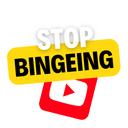

<br/>
<div align="center">
<a href="https://github.com/ShaanCoding/ReadME-Generator">

</a>
<h3 align="center">Stop binge-watching</h3>
<p align="center">
A chrome extension that prevents from mindless watching
<br/>
<br/>
<a href="https://github.com/qunikarp/stop-binge-watching"><strong>Explore the docs »</strong></a>
<br/>
<br/>
<a href="https://github.com/qunikarp/stop-binge-watching">View Demo .</a>  
<a href="https://github.com/qunikarp/stop-binge-watching/issues">Report Bug .</a>
<a href="https://github.com/qunikarp/stop-binge-watching/issues">Request Feature</a>
</p>
</div>

## About The Project

This is a final CS50 project.

### Built With

- [Chrome API](https://developer.chrome.com/docs/extensions/reference/)
- [Javascript](https://developer.mozilla.org/en-US/docs/Web/javascript)
- [CSS3](https://developer.mozilla.org/en-US/docs/Web/CSS)
- [HTML5](https://developer.mozilla.org/en-US/docs/Web/HTML)

## Getting Started

**For users**

- Search for "stop binge-watching" in google chrome extensions
- Press "Add to chrome"

**For developers**

- Download the source code
- Unzip the source code
- Open extensions menu on your browser
- Enable developer mode
- Press "Load unpacked"
- Select unzipped folder

### Installation

1. Clone the repo
   ```sh
   git clone https://github.com/qunikarp/stop-watching.git
   ```
2. Install NPM packages
   ```sh
   npm install
   ```

## Usage

From now on every Youtube tab, if it's open for over an hour will automatically close.
You can adjust the timer in settings.

## Contributing

1. Fork the Project
2. Create your Feature Branch (`git checkout -b feature/xyz`)
3. Commit your Changes (`git commit -m 'Add some xyz'`)
4. Push to the Branch (`git push origin feature/xyz`)
5. Open a Pull Request

## License

Distributed under the MIT License. See [MIT License](https://opensource.org/licenses/MIT) for more information.

## Contact

Mail - quni.inne@gmail.com

Project Link: [https://github.com/your_username/repo_name](https://github.com/qunikarp/stop-binge-watching)

## Acknowledgments

Special thanks to:

- [EDX - CS50](https://learning.edx.org/course/course-v1:HarvardX+CS50+X/home)
- [David J. Malan](https://cs.harvard.edu/malan/)
- [ddb50 ](https://cs50.ai/)

<br/>
<div align="center">
<a href="https://github.com/ShaanCoding/ReadME-Generator">

</a>
<h3 align="center">Stop binge-watching</h3>
<p align="center">
A chrome extension that prevents from mindless watching
<br/>
<br/>
<a href="https://github.com/qunikarp/stop-binge-watching"><strong>Explore the docs »</strong></a>
<br/>
<br/>
<a href="https://github.com/qunikarp/stop-binge-watching">View Demo .</a>  
<a href="https://github.com/qunikarp/stop-binge-watching/issues">Report Bug .</a>
<a href="https://github.com/qunikarp/stop-binge-watching/issues">Request Feature</a>
</p>
</div>
